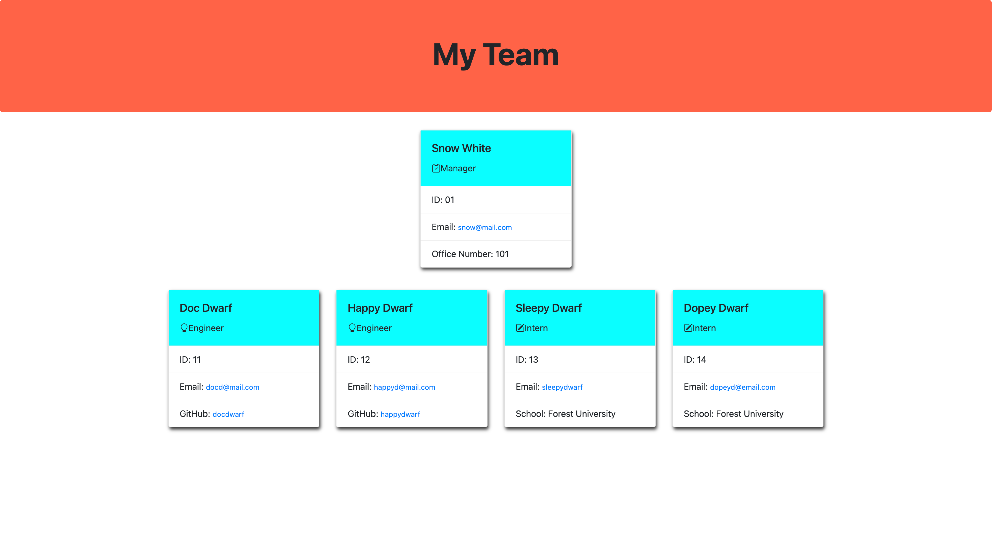

# Team Profile Generator

## Description

A command-line application that generates a dynamic roster for a professional software engineering team based on user selection and input. The input data results in an HTML that displays summaries of each employee, intern or manager. 
## Table of Contents

- [Description](#description)
- [Installation](#installation)
- [Usage](#usage)
- [License](#license)
- [Contributors](#contributors)
- [Tests](#tests)
- [Questions](#questions)
- [Contact](#contact)

## Installation

The app runs from the 'node index' command line command.

## Usage

Open the index.js file in the current terminal and then run 'node index'.

Demonstration of app
[Demonstration](https://watch.screencastify.com/v/TvfxKNvxkGAekP3GWSUo)

## License

Source link for [MIT](https://opensource.org/licenses/MIT)

## Contributors

Tim Davidson

## Tests

## Questions

undefined

## Contact

[GitHub Profile](https://github.com/www.github.com/timdavidson2)
[Email Me](timdavidson2@gmail.com)
